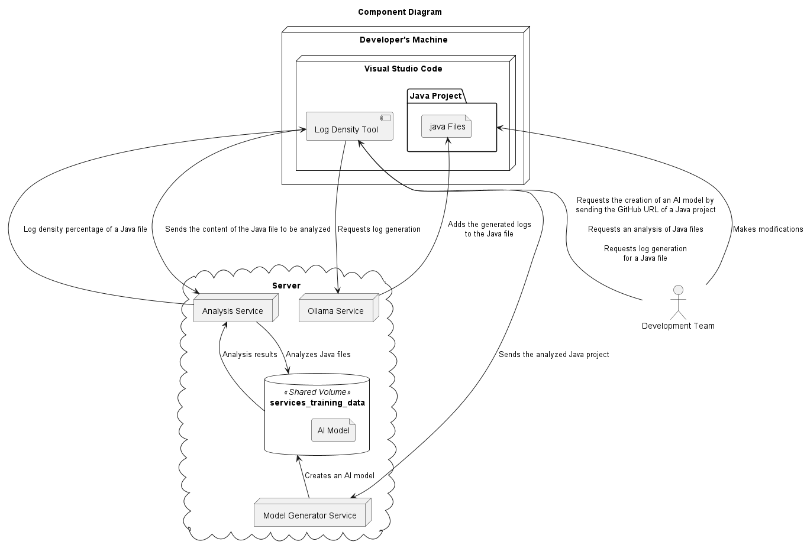

# Plant UML Diagrams

This document is simply to visualize the Plant UML Diagrams of the project.

## Table of Contents

- [Class Diagrams](#class-diagrams)
- [Components](#components)
- [Sequence Diagrams - log-density-tool](#sequence-diagrams---log-density-tool)
- [Sequence Diagrams - log-assistant-tool](#sequence-diagrams---log-assistant-tool)

## Class Diagrams

### Class Diagram - Extension

### Class Diagram - Services

## Components

### Component Diagram

## Sequence Diagrams - log-density-tool

### Sequence Diagram - Adding Files

### Sequence Diagram - File Analysis

### Sequence Diagram - Open Tabs Analysis

### Sequence Diagram - Removing Files

### Sequence Diagram - Extension Initialization

### Sequence Diagram - POST 8080 - Create

### Sequence Diagram - POST 8081 - Analyze Project

### Sequence Diagram - POST 8081 - Predict

## Sequence Diagrams - log-assistant-tool

### Sequence Diagram - Generate Log Advice

