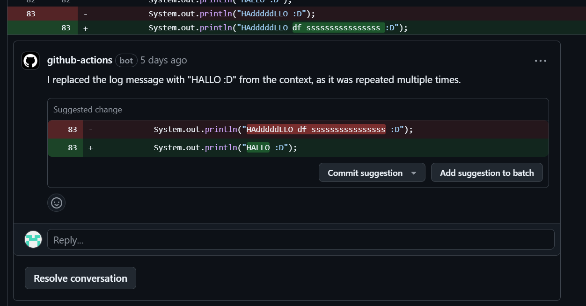

# **Guide d'installation du pipeline d'analyse des logs dans GitHub Actions**

Ce guide vous aidera à mettre en place un pipeline GitHub Actions qui analyse automatiquement les logs ajoutés dans une Pull Request (PR) et propose des améliorations via des commentaires de review.

## **1. Prérequis**
Avant de commencer, assurez-vous d'avoir les éléments suivants :
- Un **runner self-hosted** configuré sur votre dépôt GitHub.
- **Node.js 18.x** installé sur le runner.
- Un serveur **Ollama** en local ou déployé, écoutant sur `http://127.0.0.1:8000/improve-logs`.
- Un **token GitHub (GITHUB_TOKEN)** avec les permissions nécessaires pour commenter des PRs.

---

## **2. Configuration du pipeline GitHub Actions**
Votre pipeline est défini dans le fichier **`analyse-logs.yml`**.

### **Étapes du workflow**
1. **Déclenchement**  
   - S'exécute lorsqu'une PR est créée, modifiée ou synchronisée sur `main` ou `develop`.

2. **Exécution du job `analyze-logs`**
   - **Runner utilisé** : `self-hosted`
   - **Permissions** :
     - Lecture des fichiers du dépôt.
     - Écriture sur les PRs pour ajouter des commentaires.

3. **Étapes du job** :
   - **Cloner le code**
   - **Installer Node.js**
   - **Installer les dépendances**
   - **Exécuter le script d'analyse** pour détecter et améliorer les logs dans les fichiers modifiés.

---

## **3. Détails du script `queryOllama.js`**
Le script **`queryOllama.js`** va :
1. **Récupérer les fichiers modifiés** dans la PR.
2. **Analyser les fichiers Java modifiés** avec `git diff`.
3. **Envoyer les modifications au serveur Ollama** (`http://127.0.0.1:8000/improve-logs`).
4. **Récupérer et publier les suggestions** d'amélioration sous forme de commentaires de review sur la PR.

---

## **4. Utilisation**

### 1 Set up le self-hoaster runner

Si vous n'aviez pas de self-hoasted runner voici les étapes à suivre pour le set-up:

1. Allez dans l'onglet **settings**.
2. Dans la section **Actions** de **Code and automation** allez sur **runners**.
3. Cliquez sur **New self-hosted runner**.
4. Lancez les commandes généré par GitHub dans le terminal d'après le Kernel de votre ordinateur.

### 2. Utilisation et lancement de l'action GitHub.

Afin de lancer et tester l'action GitHub vous devez:

1. Si pas déjà fais, lancez le action runner `.\run.cmd`.
2. Prennez soint que les containers de **Log Density** roullent.
3. Après avoir commit des modifications dans le code Java, push le code et faites un pull request.
4. Après le pull request, l'action GitHub sera lancé et fera l'appel de l'API du serveur Ollama.
5. Après un certain temps, une suggestion sera disponible à faire sur un bout de code.

