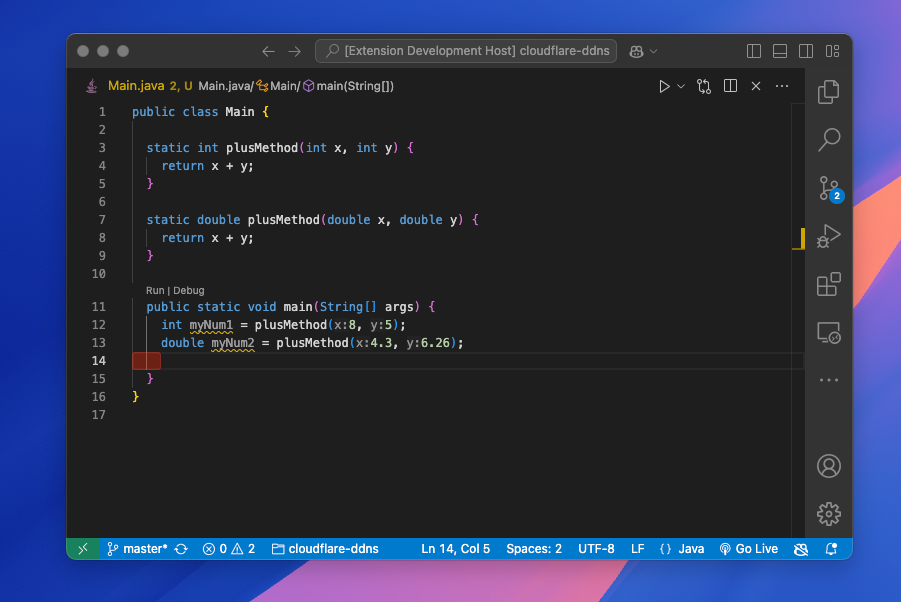
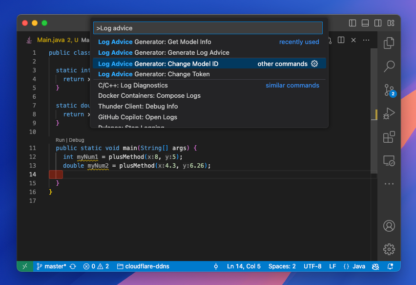
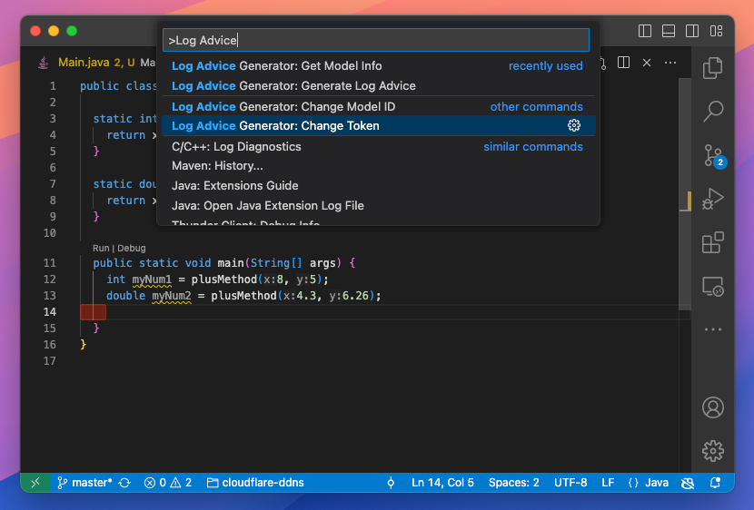
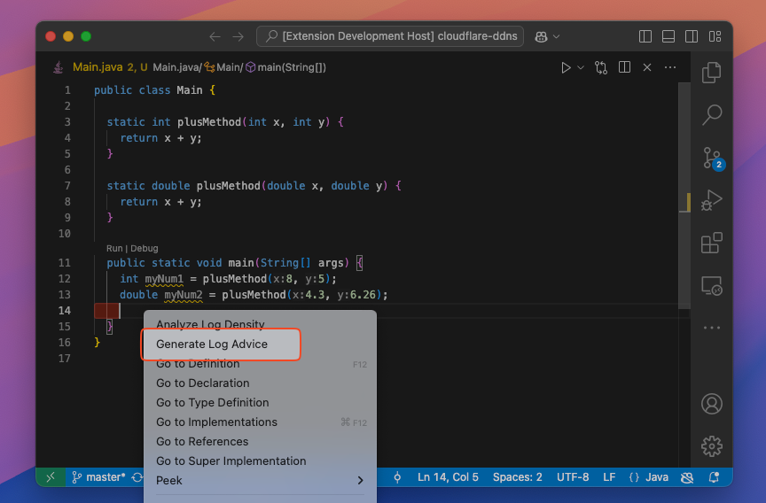
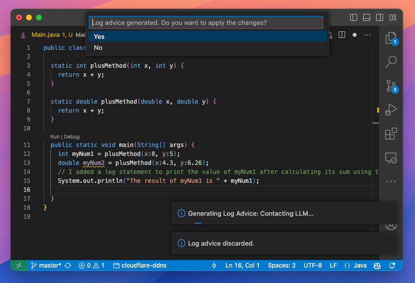

# Userguide to the Log Assistant Tool

## Table of Contents

- [Userguide to the Log Assistant Tool](#userguide-to-the-log-assistant-tool)
  - [Table of Contents](#table-of-contents)
  - [1. Introduction](#1-introduction)
  - [2. Setup](#2-setup)
  - [3. Getting Started](#3-getting-started)
  - [4. Using the Extension](#4-using-the-extension)
    - [4.1 Get model info](#41-get-model-info)
    - [4.2 Choosing a Model](#42-choosing-a-model)
    - [4.3 Setting up a token (Only for HuggingFace)](#43-setting-up-a-token-only-for-huggingface)
    - [4.4 Generating Log Advice](#44-generating-log-advice)

## 1. Introduction

Welcome to the user guide for the "Log Assistant Tool" extension, designed to suggest line of code to improve the logging density for a given Java file. This guide will help you get started with the tool.

The log assistant tool is a functionality of the log density analyzer tool that provides suggestions to improve the logging density in Java files. It uses a large language model that runs in Ollama to generate log advice at the line of code level. The tool is designed to help developers understand and optimize their logging practices.

## 2. Setup

Make sure you have followed the installation guide to install the extension.

## 3. Getting Started

1. Launch the extension by pressing the F5 key or by running the extension in **Run & Debug** or `npm start`.
2. An new window will open with the extension running.
3. Open the desired Java file, it should look like this:

## 4. Using the Extension

### 4.1 Get model info

- To get the model currently configured, use the command `Log Advice Generator: Get Model Info`.

### 4.2 Choosing a Model

- The service will automatically start the download of the default model that is define in [model_config.js](logdensitytool/src/model_config.js).
- If you want to use another model, you can do so by using the command `Log Advice Generator: Change Model ID` and entering the model ID.

### 4.3 Setting up a token (Only for HuggingFace)

- If you are using a model from HuggingFace, you will need to set up a token. You can do so by using the command `Log Advice Generator: Change Token` and entering the token.
  - If you do not have a token, you can get one by signing up on the HuggingFace website and creating a new token.

### 4.4 Generating Log Advice

- To generate log advice, put your cursor on the line of code where you want to get advice and use the command `Log Advice Generator: Generate Log Advice`.
  - There is two way to activate this command :
    - `Ctrl+Shift+P` (or `Cmd+Shift+P` on macOS) or `F1`, type `Log Advice Generator: Generate Log Advice`
    - Right click on the line of code and select `Generate Log Advice`

---

- The extension will request ollama to generate a log advice base on the line of code wanted and the code of the method/function where the line is.
- The log advice will be inserted in the file at the line of code where the cursor was.
- The extension now asked you to confirm if the generated log advice is correct.

