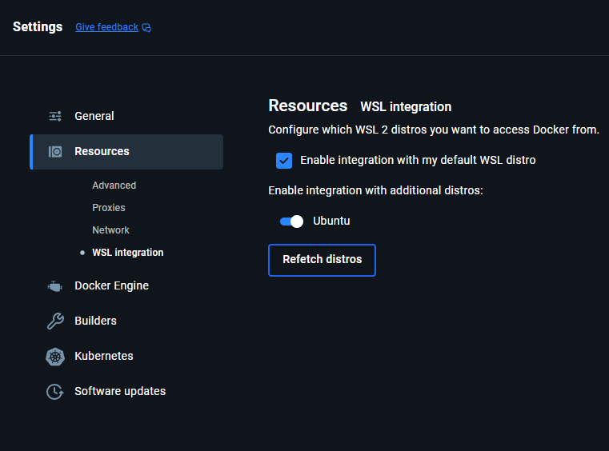

# Ollama

[Retour REAMDE.md](/README.md#ollama)

By default, ollama is bundled with the backend. There are some requirements to run on GPU, you can follow the instruction in [Docker](#docker).  
Otherwise, you can use the [App](#app)

## App

- Download here : [https://ollama.com/](https://ollama.com/){:target="_blank"}
- Once the application is started, you can use the terminal to use and run commands with ollama.
- Start backend API with this command in terminal `ollama serve`

## Docker

- Instruction here : [Docker Hub : Ollama](https://hub.docker.com/r/ollama/ollama){:target="_blank"}
- For Windows, you need to :
    1. Enable WSL2
    2. Install Ubuntu
    3. Open the instance
    4. Follow the Ollama GPU guide
    5. Enable Ubuntu wsl integration
    

Ollama Docker should use the your GPU if compatible

## Terminal Commands

- Download model : `ollama pull <model:size>`
- Run model in terminal : `ollama run <model:size>`

For more commands here is Ollama's quickstart guiide : [Github - Ollama Quickstart](https://github.com/ollama/ollama/blob/main/README.md#quickstart){:target="_blank"}

## API Documentation

[Github: Ollama API Doc](https://github.com/ollama/ollama/blob/main/docs/api.md){:target="_blank"}

## Model Search

[Ollama Model Search](https://ollama.com/search){:target="_blank"}
